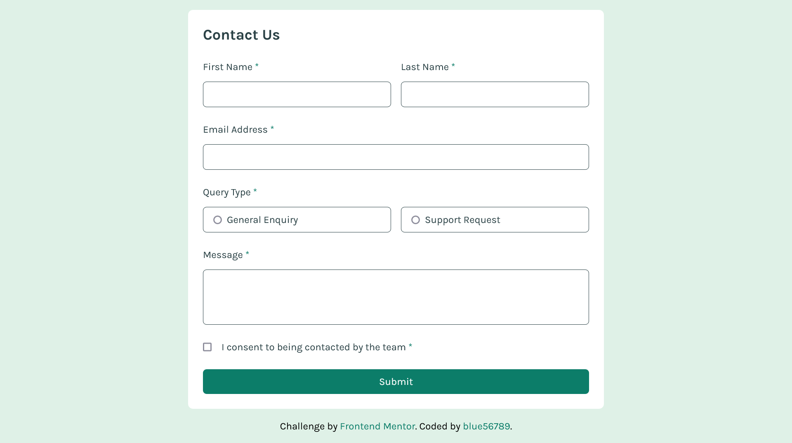

# Frontend Mentor - Contact form solution

This is a solution to the [Contact form challenge on Frontend Mentor](https://www.frontendmentor.io/challenges/contact-form--G-hYlqKJj). Frontend Mentor challenges help you improve your coding skills by building realistic projects.

## Table of contents

-   [Overview](#overview)
    -   [The challenge](#the-challenge)
    -   [Screenshot](#screenshot)
    -   [Links](#links)
-   [My process](#my-process)
    -   [Built with](#built-with)
    -   [Continued development](#continued-development)
-   [Author](#author)

## Overview

### The challenge

Users should be able to:

-   Complete the form and see a success toast message upon successful submission
-   Receive form validation messages if:
    -   A required field has been missed
    -   The email address is not formatted correctly
-   Complete the form only using their keyboard
-   Have inputs, error messages, and the success message announced on their screen reader
-   View the optimal layout for the interface depending on their device's screen size
-   See hover and focus states for all interactive elements on the page

### Screenshot



### Links

-   Solution URL: [Add solution URL here](https://your-solution-url.com)
-   Live Site URL: [Add live site URL here](https://your-live-site-url.com)

## My process

### Built with

-   Semantic HTML5 markup
-   Flexbox
-   Mobile-first workflow
-   [React](https://reactjs.org/) - JS library
-   [Tailwind](https://tailwindcss.com/)

### Continued development

The input validation code is quite repetitive.

```js
copy["fname"] = fname.current ? fname.current.checkValidity() : false;
allValid = allValid && copy["fname"];
copy["lname"] = lname.current ? lname.current.checkValidity() : false;
allValid = allValid && copy["lname"];
copy["email"] = email.current ? email.current.checkValidity() : false;
allValid = allValid && copy["email"];
copy["query"] = query.current ? query.current.checkValidity() : false;
allValid = allValid && copy["query"];
copy["message"] = message.current ? message.current.checkValidity() : false;
allValid = allValid && copy["message"];
copy["consent"] = consent.current ? consent.current.checkValidity() : false;
allValid = allValid && copy["consent"];
setValid(copy);
```

## Author

-   Github - [blue56789](https://github.com/blue56789/)
-   Frontend Mentor - [@blue56789](https://www.frontendmentor.io/profile/blue56789)
